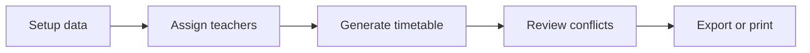

# Timora

Smart timetable scheduling made effortless.

Timora is a clean, single-file timetable manager for schools, colleges, and training programs. It helps you define classes, teachers, rooms, subjects, and time slots, then generate a timetable with conflict checks, drag-and-drop edits, and export options.

## Highlights

- Setup classes, teachers, rooms, subjects, and weekly time slots in one place.
- Assign subjects to teachers manually or with auto-assignment.
- Generate timetables with checks for missing setup, overloads, and conflicts.
- View schedules by class, teacher, or room.
- Drag lectures between slots, add entries manually, and delete with one click.
- Save and load data as JSON, or export class timetables as CSV.
- Print-friendly timetable view for quick sharing.

## How to Use

1. Open `timetable-manager.html` in a browser.
2. Add your classes, teachers, subjects, rooms, and working days in Setup.
3. Assign each subject to a teacher in Assign.
4. Run Generate to build the timetable.
5. Review the Timetable and Conflicts tabs, then export or print when ready.

## Project Structure

- `timetable-manager.html` - the full application UI and logic in a single file.
- `README.md` - project overview and usage guide.

## Features at a Glance

## Notes

- No build step is required.
- All state is stored locally in the browser unless you export or save the JSON file.
- The UI is designed to stay usable on both desktop and mobile screens.
